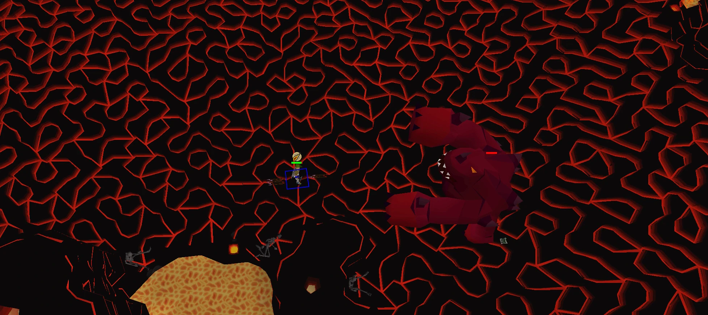

<p align="center">
  
</p>

<h1 align="center">Fight Caves RL</h1>

<p align="center">
  <a href="https://github.com/jordanbailey00/fight-caves-rsps/actions/workflows/test-with-coverage.yml"></a>
  <a href="https://github.com/jordanbailey00/fight-caves-rsps/actions/workflows/create_release.yml"></a>
  
  
  
  
</p>

Headless, deterministic Fight Caves simulator extracted from Void RSPS and built for reproducible RL training at game-tick resolution.

## What This Project Is

Fight Caves RL is a runtime-focused extraction of the Fight Caves combat loop and dependencies from an RSPS codebase.  
It provides:

- A **headed oracle runtime** for reference behavior.
- A **headless simulation runtime** for high-throughput training and batch evaluation.
- A **parity harness** that validates headless behavior is 1:1 with the headed game under identical seeds and action sequences.

The acceptance target is strict: train in headless mode, deploy learned policy in headed mode, and see matching behavior.

## Features

- Deterministic episode initialization contract (seeded reset and reproducible start state).
- Tick-accurate simulation stepping (one action intent per tick).
- Fight Caves-only script and data closure loading (explicit allowlists).
- Runtime drift guards for scripts, data files, and manifest closure.
- Oracle vs headless differential testing and parity assertions.
- Structured trajectory outputs for RL training pipelines.
- Startup fail-fast checks for missing or non-allowlisted runtime dependencies.
- Performance-oriented headless path without networking/login server loops.

## Quick Setup

1. Clone the repository.

```bash
git clone https://github.com/jordanbailey00/fight-caves-rsps.git
cd fight-caves-rsps
```

2. Install dependencies (JDK 21+, Git, and Python 3.11+ for RL tooling).
3. Build the project and run tests.

```bash
./gradlew clean build
```

4. Run parity and headless test suites.

```bash
./gradlew :game:test --tests "headless.*"
./gradlew :game:test --tests "content.area.karamja.tzhaar_city.TzhaarFightCaveTest"
```

5. Start the simulator runtime and begin episode stepping from your agent runner.

```bash
./gradlew :game:runHeadless
```

## Dependencies

- `Git` (2.40+ recommended)
- `JDK 21+` (Temurin recommended)
- `Python 3.11+` (for RL training/rollout tooling)
- `Gradle` (wrapper included, no global install required)

### Install Dependencies

Windows (`winget`):

```powershell
winget install --id EclipseAdoptium.Temurin.21.JDK -e
winget install --id Git.Git -e
winget install --id Python.Python.3.11 -e
```

macOS (`brew`):

```bash
brew install --cask temurin
brew install git python@3.11
```

Ubuntu/Debian:

```bash
sudo apt update
sudo apt install -y git openjdk-21-jdk python3.11 python3.11-venv
```

## How To Use

### Run Headed Oracle Runtime

```bash
./gradlew :game:run
```

### Run Headless Simulator

```bash
./gradlew :game:runHeadless
```

### Run Full Parity Suite

```bash
./gradlew :game:test --tests "headless.parity.*"
```

### Build Distribution Artifact

```bash
./gradlew :game:bundleDistZip
```

## Project Layout

- `spec.md`: extraction and parity contract.
- `plan.md`: implementation and validation execution plan.
- `e2e test.md`: full end-to-end acceptance test matrix.
- `docs/`: extraction manifest, runtime docs, and change log.
- `config/`: headless manifests and allowlists.
- `game/src/main/kotlin/`: runtime entrypoints and content scripts.
- `game/src/test/kotlin/headless/`: headless/parity test suites.

## License

This project is licensed under the MIT License.
